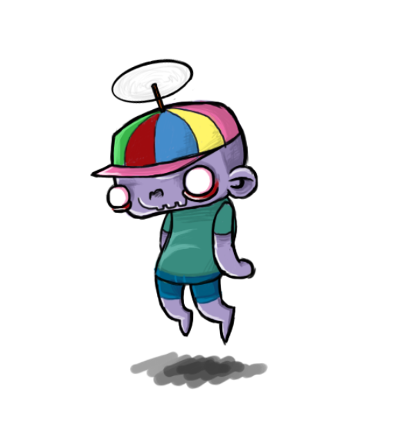

# Vue and friends Boilerplate



This is a repository in the form of a boilerplate / template based on a Vue base project through vue-cli plus a few add-ons.

It is designed to start any short or medium project, as well as to perform experiments or test things.

Among other things, it has the following...

## Utilities / tools:

- Vue
- Webpack (
fully configured 🤪)
- Babel
- Coke 🥤(my own SASS framework).
  - Include media library.
  - ITCSS-like.
  - Flexbox Utilities.
  - Utility classes.
  - Debug.
  - Animation, gradients, etc.
  - Sugar Syntax!
- PostCSS (support and Autoprefixer)
- Husky (pre-commit git hooks).
- ESLint
- StyleLint
- Prettier
- SASS
- Pug 🐶
- Jest

Just use what interests you. 

## To install
```
nvm use
```
Note: If you use NVM. If not, the node version is in .nvmrc file. Be careful.

```
npm install
```

## To launch

```
npm run dev
```

---

Any contribution is welcome 😊

